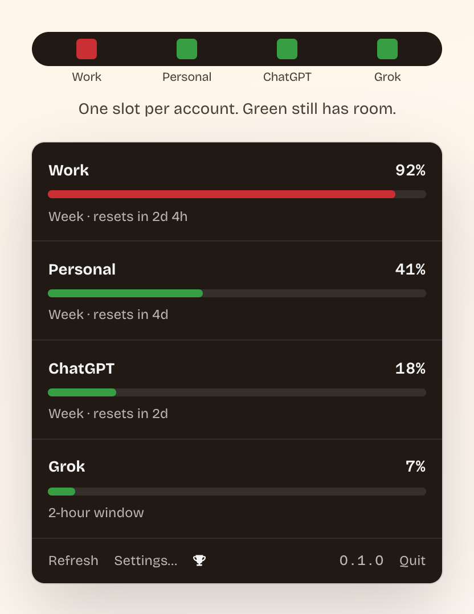

# WhatsMyUsage

**Every AI limit. One glance.**

Checking your usage means opening the app, finding the right page, clicking
through — for every provider, every time. Now it lives in your menu bar:
Claude, ChatGPT, and Grok, all your accounts, one pill.

[whatsmyusage.com](https://whatsmyusage.com) · [Download / build](#build-from-source)

<p align="center">
  
</p>

Free. Open source. Native on macOS 14+. Cat included.

## Two accounts? No more logging out.

Every account gets its own slot in the pill — with its own name. "Work",
"Personal", "The Max plan I don't talk about." No signing out, no switching,
no guessing which slot is which.

**See which account has room.** Green means go. Glance at the colors, pick the
account with room, and send the big job there.

**Know when you are back.** Blocked is temporary. Every limit shows when it
resets — and when a slot turns from red to green, that account is back in the
game.

**Show only what you check.** Hide the limits you never worry about — the
weekly one that never runs out, the provider you barely use. The pill stays
down to the numbers you actually look at.

Everything runs on your Mac. The app talks directly to Anthropic, OpenAI, and
xAI — there is no WhatsMyUsage server, and nothing is sent anywhere else. Open
source, so you can check.

## You were going to max out anyway.

Now it counts. 42 achievements for the way you already work: your first full
limit, a night shift, a lost weekend, all three providers blocked at once.
Nothing to set up. The app just notices — quietly, like the cat.

- **Grand slam** — All three providers blocked at once.
- **Night shift** — Limit burned between 1 and 5 in the morning.
- **Lost weekend** — Full for forty-eight hours straight.
- **Clean month** — Thirty days without hitting a single limit.
- **The answer** — Earn every other one.

## Using it

The app is a menu bar accessory. Add each account once.

The pill has one slot per account: green has room, red is closed. Click it
for details and reset times.

## Build from source

```
git clone https://github.com/getzenai/whatsmyusage.git
cd whatsmyusage
Scripts/make-app-bundle.sh        # → .build/WhatsMyUsage.app
open ".build/WhatsMyUsage.app"
```

---

## For developers

Existing bars only show Claude's 5-hour window. Measured 2026-08-15:
5h window **0 %**, weekly limit **100 %** — the bar would have read "0 %" while the
account was locked out. The app has to look at every limit and show the **worst**
one.

Slot colour is green under 70 %, yellow 70–89 %, orange 90–99 %, and red only
when locked or the meter reads 100 %. A full model limit stays in the popover.

### Providers

| Provider | Endpoint | Status |
|---|---|---|
| Claude | `/api/bootstrap`, `/api/organizations/{id}/usage` | measured live, see [docs/RESEARCH_CLAUDE_ENDPOINT.md](docs/RESEARCH_CLAUDE_ENDPOINT.md) |
| ChatGPT | `/api/auth/session` → Bearer → `GET /backend-api/wham/usage` + `rate-limit-reset-credits` (display only) | measured live, see [docs/RESEARCH_CHATGPT_GROK_ENDPOINTS.md](docs/RESEARCH_CHATGPT_GROK_ENDPOINTS.md) |
| Grok | `POST /rest/rate-limits` (2 h, per model) + `GetGrokCreditsConfig` (weekly, grpc-web) + `GetRemainingResets` (vouchers, display only) | measured live, see [docs/RESEARCH_GROK_WEEKLY_LIMIT.md](docs/RESEARCH_GROK_WEEKLY_LIMIT.md) |

### Handling cookies

Session cookies (`sessionKey`, `__Secure-next-auth.session-token.*`, `sso`) are full
logins. They **never** belong in a chat, issue, commit, log, or test fixture.

- Entry happens locally in the app, straight from the browser into the paste field.
- Storage in the macOS Keychain, never in a file in the repo.
- Test fixtures: real response structure, values replaced by placeholders.

**This repo is public.** The same rule therefore covers everything
account-related: no org UUIDs, email addresses, org names, or real usage numbers — what gets
documented is the *shape* of a response, never an account.

On ChatGPT the session token is split across several numbered cookies
(`…session-token.0`, `…session-token.1`) — extraction has to reassemble the parts sorted by
index, otherwise the token is silently invalid.

First launch is a short wizard: welcome (Keychain warning + preview of the macOS
prompt) → paste cookies (Continue stores them) → here's what we found → close
and use the bar. Chrome: log in → right-click Inspect / ⌥⌘I → Application →
Storage → Cookies → the site (claude.ai and a.claude.ai are separate) → ⌘A ⌘C.
Paste in the window. Only the session keys go into the Keychain; the rest of the
paste is discarded. Two logins of the same provider (two Claude Max emails) are
two rows. Pasting a refreshed cookie for the same login updates that row.

The compact pill's colour comes from the mean utilisation of each account's
shortest window. A lock on one account does not paint it red: ChatGPT and
Grok send `locked` for a meter that reached 100 % and nothing more, so obeying
any lock made the one slot red almost always. The 100 % is already in the mean.
Everything shut therefore still reads red, and one open account among four full
ones lands in the warning band. Claude never sends a lock state, so a full
meter counts as blocked on its own.

### Building

`Scripts/make-app-bundle.sh` also builds the `whatsmyusage` CLI and copies
it to `~/.local/bin/whatsmyusage`, so agents can run `whatsmyusage status --json`
without a path. The CLI does not go into the `.app` — the app never launches
it, and on a case-insensitive volume `Contents/MacOS/whatsmyusage` is the
same path as `WhatsMyUsage`. The script refuses to overwrite a destination
that already exists under a different name.

The app icon and the site's favicon are one drawing: `Scripts/make-icon.swift`
renders `Resources/AppIcon.icns` and `site/favicon.png` from `site/cat-fabi.svg`
— the hero cat — on the app's yellow square, with the stroke thickened at the
middle sizes. At 64 px and below the whole cat runs into mush however thick the
pen, so those sizes show only the cross on the cat's rear; the favicon is one of
them, because a browser tab is 16 px. Both outputs are committed, so a
build needs neither the script nor an SVG renderer. Run it when the drawing or
the brand colours change.

Without `USAGE_BAR_SIGN_IDENTITY` the bundle is ad-hoc signed. That identity
is the binary hash, so Keychain treats every rebuild as a new app and prompts
again. A named certificate stays put:

```
USAGE_BAR_SIGN_IDENTITY="WhatsMyUsage Local" Scripts/make-app-bundle.sh
```

Make one in two minutes: Keychain Access → Certificate Assistant → Create a
Certificate… → name it (this is the identity string), Identity Type **Self
Signed Root**, Certificate Type **Code Signing**. The first open still needs
right-click → Open (self-signed, Gatekeeper). After that the Keychain asks
once, then stays quiet across rebuilds.

The bundle id is `com.whatsmyusage.app`. The Keychain item — the name macOS
shows in the access prompt — is `whatsmyusage.com`. A rebuild after a rename
asks once more, then copies cookies from the previous names
(`com.whatsmyusage.app`, `de.getzenai.ai-usage-bar`).

The version in the bundle is the latest `v<x.y.z>` git tag, and `CFBundleVersion`
is the commit it was built from. See [AGENTS.md](AGENTS.md) → Versioning.

Settings has a **Start at login** checkbox. It calls `SMAppService`, the same
switch as System Settings › General › Login Items, and stores nothing of its
own — the checkbox always shows what launchd has registered. Only the `.app`
can register itself; running the bare `swift run` binary leaves it disabled.

⌘R refreshes, ⌘, opens Settings, ⌘Q quits. The bar also refreshes every five
minutes on its own.

### Provider incidents

A full meter is one reason nothing works; a provider outage is the other. The
app reads the public status pages of Claude, OpenAI, xAI and GitHub and shows
the answer where the question comes up:

- a **banner on the account card** when that provider has an incident, plus a
  small dot in its pill slot — ink, not a new colour, because the pill's scale
  means "how full" and a foreign outage must not repaint it;
- **one grey line** under the accounts when nothing is wrong: `No incidents ·
  checked 14:52`. A standing "All Systems Operational" trains the eye to skip
  the spot, and the real outage gets skipped with it — the time is the whole
  content of that line;
- **`Status unchecked`** when a page did not answer. Silence is never rendered
  as health;
- GitHub belongs to no account, so it speaks on that line instead of a card.

Settings › *Status tracking* switches the whole thing off — no line, no banner,
**and no requests** — or any single page, or the services within one. Defaults:
Claude `claude.ai`, `Claude Code`, `Claude API`; xAI `Grok (Web)` and
`Single Sign-On`; GitHub `Actions`, `API Requests`, `Pull Requests`, `Issues`.
OpenAI has no default: its page lists two services called "Login" and its
incidents name no service at all, so filtering by name would only pretend to
filter. What each page really sends is in
[`docs/RESEARCH_STATUS_PAGES.md`](docs/RESEARCH_STATUS_PAGES.md) — including
why the badge at the top is never read.

`whatsmyusage pick` ignores all of it. It answers "where is there quota left",
not "what is broken".

### CLI

`whatsmyusage` with no arguments prints the usage block, then which account
to use, then one line per account. `--json` is the data structure. Names and
hidden limits come from the app; hiding is display only. A reading older than
five minutes plus 90 seconds is unknown — never an old number presented as
current.

```
whatsmyusage
whatsmyusage status [--json] [--limits]
whatsmyusage pick [--provider claude]
whatsmyusage achievements --json
```

`pick` exits 0 when an account still has room and 1 when every account is
blocked or stale (stdout then carries the earliest `resetsAt`). A full
model-scoped limit (Fable, Opus, …) blocks the account even when `weekly_all`
has room; the reported `utilization` is still the worst *account* limit.
JSON keys are the model names: `trackingID`, `limitID`, `utilization`, `resetsAt`.

`locked` is what the provider sent. Claude never sends one — every Claude
limit is `unknown`, including a 100 % week. `is_active` on the Claude
response is not a lock (a model limit at 24 % has been seen `is_active:
true` while `weekly_all` sat at 14 %). Read `utilization` (and `pick`'s
exit code) to decide whether the account is usable. ChatGPT sends
`allowed`. Grok's 2-hour window locks at remaining zero; the weekly
credits call locks only at 100 %.

### Core

`UsageBarCore` is testable without a network:

- `SessionCookies.extractSessionKey` — cookie text → Claude `sessionKey`, ChatGPT parts
  (sorted by index, sent back as numbered cookies), Grok `sso`
- `UsageParser.parseUsage` — HTTP status + body → common model
  (label, utilization 0…1, optional reset, locked yes/no/**unknown**)
- `UsageParser.chatGPTAccessToken` — `/api/auth/session` → Bearer; if `accessToken`
  is missing, the session has expired
- `UsageParser.parseGrokWeekly` — grpc-web body → weekly limit, only if the
  period is `weekly`; every error is `nil`, not "!"
- 401 = expired; 403 on a Claude org = that org is not trackable;
  403 on ChatGPT/Grok is **not** a logout (Cloudflare)

One translator per provider. Claude never invents a lock state. ChatGPT takes `allowed`.
Grok infers locked from `remainingQueries == 0`.

### Website

Static landing page in [`site/`](site/). Push to `main` deploys it to
[whatsmyusage.com](https://whatsmyusage.com) via GitHub Actions → Cloudflare Pages.

### Contributing

Pull requests are welcome. Open an issue first for a larger change. Every PR is
squashed; title it as a Conventional Commit so the release job can read it.
`swift test` must pass on the commit you claim it passes on. Check a title with
`Scripts/semver.py check-title "feat: …"`. See [AGENTS.md](AGENTS.md) for the
rest of the rules.

## License

MIT — see [LICENSE](LICENSE).
